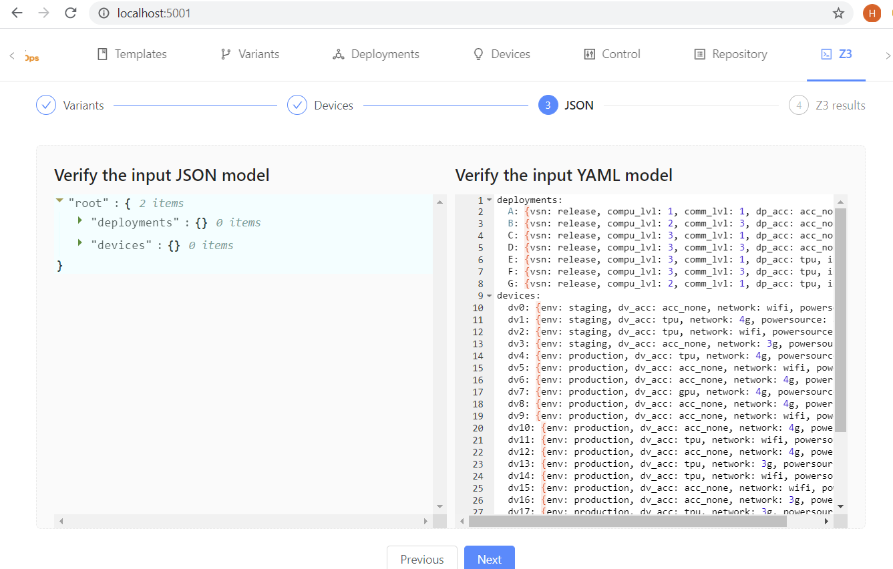

# DivENACT: Diversity-Aware Fleet Management of Edge Devices

DivENACT is an online tool for managing a fleet of Edge devices (gateways) based on Azure IoT Hub. The functionality is currently distributed across 8 tabs in the GUI:


- **Templates**: lists the available deployment templates, stored on the local MongoDB. The tab also provides basic editing functionality to modify templates.
- **Variants**: lists the available variants (linked to templates) that can be parameterised and pushed for deployment to Azure IoT Hub. The tab also provides basic editing functionality to modify variants.
- **Deployments**: lists the deployments, as fetched from Azure IoT Hub. 
- **Devices**: lists the edge devices, as fecthed from Azure IoT Hub. The tab also provides basic editing functionality to tag devices with certain properties.
- **Control**: provides some basic functionality for instantiating varinats based on abailable templates, diversifying them and pushing for deployment to Azure IoT Hub (**NB: for testing purposes only**).
- **Repository**: lists all entities stored on the local MongoDB (**NB: for testing purposes only**).
- **Z3**: provides functionality for designing assignment based on template/variant parameters and device properties. The designed assignment logic is fed to Z3 solver for solving and, upon approval, is finally pushed to Azure IoT Hub for deployment.
- **OR-Tools**: provides functionality for designing assignment based on template/variant parameters and device properties. The designed assignment logic is fed to OR-Tools solver for solving and, upon approval, is finally pushed to Azure IoT Hub for deployment (**NB: for testing purposes only**).

## Features

### Short term

| id | name | dep | status |
|---|---|---|---|
| 1 | create a deployment| | done |
| 2 | set tag to one device | | done |
| 3 | update a deployment with condition | | |
| 4 | create (or appoint) a production deployment | 1 | done? |
| 5 | create a preview deployment | 1 | |
| 6 | tag _n_ devices to preview | 2 | |
| 7 | a separate daemon to send device info | | hard? |
| 8 | a listener of device info | 7 | |
| 9 | monitor lifecycle of devices | | |
| 10 | keep _n_ devices for preview | 9 | | |
| 11 | move all devices to product | 4, 6 | | |
| 12 | command line UI in node | | |
| 13 | track devices installed on edge | 7 | |
| 14 | shuffle devices among diverse versions | 1, 2 | |

# Getting started

The main part of DivENACT is an online service with a browser-based GUI, which manages a fleet of Edge devices (gateways). To use the full functionality of this service, you need an Azure IoT Hub instance and a number of virtual devices registered in the hub. The first two pre-installation steps explain hwo to obtain the IoT Hub instance and how to prepare the devices. The third section explains the installation and usage of the DivENACT service itself.

If you want to quickly check how the tool looks and try the fleet assignment function (which is relatively independent to the devices and the IoT Hub), you can skip the first two sections and directly go to Section 3 and install DivENACT via Docker.

## Create cloud resources

Follow [this tutorial](https://docs.microsoft.com/en-us/azure/iot-edge/quickstart-linux) to create an Azure IoT hub and add one (or more) *IoT Edge Devices*. Skip the steps for creating virtual machine (we will use real device) and deploy modules (this is what this tool will do, in a programmatic way).

Remember the following credentials:
- IoT hub connection string
- The edge device's connection string

## Bootstrap edge device

- Upload the [edge/bootstrap] directory the device (Raspberry Pi). 
- Create a empty ```connection.credential``` file, or ```cp connection.credential.bak connection.credential```. Copy the connection string into this file
- ```sudo bash ./setup.sh```

Alternative way:
- SSH into the edge device
- ```curl -L https://raw.githubusercontent.com/SINTEF-9012/divenact/master/edge/bootstrap/setup.sh -o setup.sh```
- ```echo '<Your device connection string>'>connection.credential```
- ```sudo bash ./setup.sh```

## Execute diversity management services

### Really quick start
This subsection provides a quick way to run a lite version of DivEnact without the requistion of Azure IoT Hub, real (or simulated) IoT devices, nor the document database. All you need is Docker 19.03 or above. You can use this way to see how the DivEnact GUI looks like, and have a taste of what functions it could provide you, without being able to actually see any devices or deploy anything, since it relies on Azure IoT Hub. But you can try one of the core functions, i.e., the *fleet assignment* of multiple deployments on a fleet of many devices, since it is relevantly independent to the real devices.

Launch DivEnact with one comment:
```docker run -p 5001:5001 songhui/divenact:models20 --no-db```
It takes a couple of minutes to launch, and you will see some logs indicating the progress (do not run with ```-d``` for this purpose). When you see "Successfully connected to the memory DB", it is ready to open the GUI.

In your favorate browser, go to ```http://localhost:5001/```. You will be directly guided to the page for fleet assignment. All the other pages for device listing, deployment checking, etc., are available, and you are free to check them out, but there are not any devices or deployments, since we are not connected to Azure IoT Hub. Be prepared to see some error messages in the terminal where you run Docker -- DivEnact is trying to get the devices via a non-existing Azure IoT connection string. But don't panic, normally the system will not crash.

The fleet assigment function is working well. We need mockup model for devices and deployments, some examples can be found in this [folder](smt/sample_data). Open one of the yml files, copy the text and paste it into the "Verify the input YAML model" text area (we skip the generation of such YAML model, so it is not really to verify it here). After that push the button "Next". In a few seconds (or minutes), you will see a new page of the assignment result.

, . 

In the output, you can see the output snapshot that Deployment B is assigned to 3 devices.

### Installation
The main DivEnact service is developed in JavaScript based on the React and Ant.Design. It can be installed in most environments supporting Node.js. However, we recommend to run it as a Docker container, and will only explain how to install and run it using Docker. Installation on other environments is possible, and the [Dockerfile](service/Dockerfile) provides a reference for the installation in Debian/Ubuntu.

If you want to build the latest version of DivEnact, please download the source code and build the Docker image following the next instruction. Otherwise, we have a pre-built image based on the release 1.0 in Docker Hub. You can skip the building step

#### Building the Docker image
```
git clone https://github.com/SINTEF-9012/divenact
cd divenact/service
docker build -t <divenact-image-tag> . 
```
Building takes up to 5 minutes.

#### Pull pre-built image
Alternatively, you can directly pull the DivEnact image from Docker Hub. 
```docker pull songhui/divenact:models20```

### Launching DivEnact with full functions
DivEnact needs a Azure IoT Hub connection string and a document database. 
```
docker run -d -p 27017:27107 -v ~/data:/data/db mongo
docker run -p 5001:5001 <divenact-image-tag> --connection=<IoTHub-connection-string> --database=mongodb://localhost:27017/test
```

### Commandline interface

```node ./build/main.js <command> [--version] [--help]```

```
Top level Commands:
  device         Handle edge devices
  deployment     Handle deployments
  global         Handle devices and deployments together
  help [cmd]     display help for [cmd]
```

```node .\build\main.js global <command>```

```
Commands:
  production <variation>: set variant for production, and tag all devices into 'production'
  preview [options] <variation>: set variant for preview, and tag all or random devices into 'preview'
    Options:
        -r, --random <N>  Preview on N random devices
```

```node ./build/main.js device <command>```

```
Commands:
  list|ls [options] : List all edge devices
    Options:
        -d, --details        show details
        -t, --tag <tagName>  show devices and their values of this tag
        -h, --help           output usage information
  tag [options] <id> [otherIds...]: Add/update tags to devices (appointed by id's, or randomly with a number)
    Options:
        -e, --environment <value>  set environment tag
        -c, --capability <value>   set capability tag
        -r, --random               tag randomly N devices
        -h, --help                 output usage information
```

```node ./build/main.js deployment <command>```

```
Commands:
  list|ls [options]
    Options:
        -c, --conditions  show target conditions
        -h, --help        output usage information
  add [options] <variation>: add the deployment variation into IoT Hub
    Options:
        -e, --environment <value>  set the environment tag
        -h, --help                 output usage information
```

## Auto-provisioning via Azure Device Provisioning Service (using symmetric keys)

- Create an instance of Device Provisioning Service (DPS) and link it your existing Iot Hub as described [here](https://docs.microsoft.com/en-us/azure/iot-dps/quick-setup-auto-provision)
- Create and save an individual enrollment with the following parameters:
  - Mechanism: Symmetric Key
  - Auto-generate keys: Yes
  - Registration ID: *{registration_id}*
  - IoT Hub Device ID (optional): *{device_id}* 
  - Select how you want to assign devices to hubs: Static configuration
  - Select the IoT hubs this device can be assigned to: *{your_existing_iot_hub}*
  - In the Initial Device Twin State it is possible to include target conditions using tags, so that the provisioned device gets immediately affected by a deployment. For example:
    ```
    {
      "tags": {
       "environment": "test"
      },
      "properties": {
       "desired": {}
      }
    }
    ```
- Keep note of device registration ID ```registration_id```, primary key ```symmetric_key```, and DPS ID Scope```scope_id```, which will be used below.

- SSH into the edge device and open ```config.yaml```:
```sudo nano /etc/iotedge/config.yaml```
- Modify and save ```config.yaml``` as follows using previously noted values (pay attention to spaces in yaml!):
```
# provisioning:
#  source: "manual"
#  device_connection_string: "{connection_string}"

# DPS symmetric key provisioning configuration
provisioning:
 source: "dps"
 global_endpoint: "https://global.azure-devices-provisioning.net"
 scope_id: "{scope_id}"
 attestation:
  method: "symmetric_key"
  registration_id: "{registration_id}"
  symmetric_key: "{symmetric_key}"
```
- Restart the IoT Edge service:
```systemctl restart iotedge```
- After some time your device will be registered in your IoT Hub (using either ```registration_id``` or ```device_id```). 
- If specified tags match one of the deployments target conditions, the device will also be assigned with that deployment.
